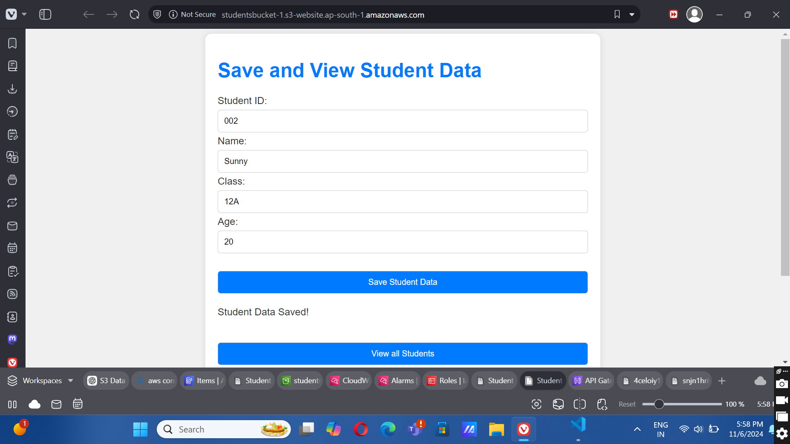
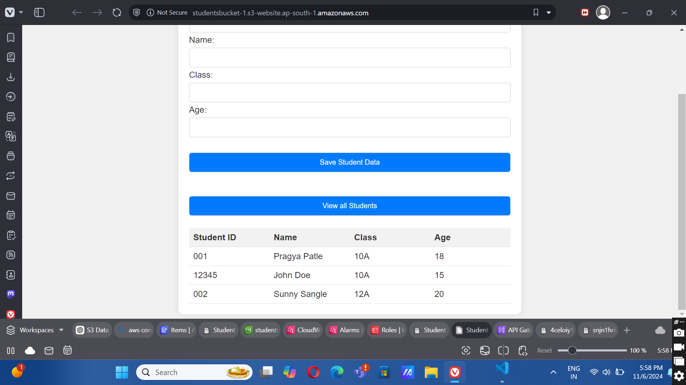

Student Information Management System
A serverless web application built using AWS services that allows users to manage student information. This project demonstrates the integration of various AWS technologies to create a fully functional and secure application.

Project Description
The Student Information Management System enables users to save and view student records, including:
* Student ID
* Name
* Class
* Age
The system leverages AWS to provide a scalable, secure, and user-friendly experience. The front end is built with HTML, CSS, and JavaScript, while AWS Lambda and DynamoDB handle backend logic and data storage.

Features
* Save Student Data: Input fields to save a student's ID, name, class, and age.
* View All Students: Retrieve and display all student records stored in the database.
* Secure and Scalable: Utilizes AWS services for a serverless and scalable architecture.
* HTTPS with CloudFront: Ensures secure data transmission using AWS CloudFront.

Technologies Used
* Frontend: HTML, CSS, JavaScript
* Backend: Python (AWS Lambda functions)
* Database: AWS DynamoDB
* Other AWS Services: S3, API Gateway, Lambda, CloudFront

Installation Instructions
Prerequisites
* An AWS account
* AWS CLI configured on your machine
* Basic knowledge of HTML, CSS, JavaScript, and Python
Steps to Set Up
1. Clone the repository:
bash
Copy code
git clone https://github.com/SunnySangle/Student-Information-Management-System.git
2. Set up AWS services:
o S3: Configure a bucket for static website hosting.
o API Gateway: Set up to connect with your Lambda functions.
o DynamoDB: Create a table to store student data.
3. Upload frontend files to S3:
o Upload index.html and scripts.js to the S3 bucket.
4. Deploy Lambda functions:
o Create Lambda functions for GET and POST requests.
o Connect the Lambda functions to your API Gateway.
5. Configure CloudFront:
o Enable HTTPS and set up CloudFront to serve your S3 content securely.

How to Use
1. Open the hosted web page from your S3 bucket URL.
2. Enter student details (ID, name, class, age) and click Save Student Data to store the information.
3. Click View All Students to retrieve and display all stored records.

Screenshots

[Screenshot of View Lambda Function](screenshots/screenshot3.png)
[Screenshot of View getStudent lambda](screenshots/screenshot4.png)
[Screenshot of View getStudent lambda](screenshots/screenshot5.png)
[Screenshot of View getStudent output](screenshots/screenshot6.png)
[Screenshot of View Application Autoscaling](screenshots/screenshot7.png)
[Screenshot of View Policy Statement](screenshots/screenshot8.png)
[Screenshot of View Resource based policy](screenshots/screenshot9.png)
[Screenshot of View Cloudwatch 1](screenshots/screenshot10.png)
[Screenshot of View Cloudwatch 2](screenshots/screenshot11.png)
[Screenshot of View Cloudwatch 3](screenshots/screenshot12.png)
[Screenshot of View Cloudwatch 4](screenshots/screenshot13.png)
[Screenshot of View Cloudwatch 5](screenshots/screenshot14.png)
[Screenshot of View Cloudwatch 6](screenshots/screenshot15.png)
[Screenshot of View insertStudentData Lambda](screenshots/screenshot16.png)
[Screenshot of lambda function Output](screenshots/screenshot17.png)
[Screenshot of View Cloudwatch 1](screenshots/screenshot18.png)
[Screenshot of View Cloudwatch 2](screenshots/screenshot19.png)
[Screenshot of View Cloudwatch 3](screenshots/screenshot20.png)
[Screenshot of View Cloudwatch 4](screenshots/screenshot21.png)
[Screenshot of View Cloudwatch 5](screenshots/screenshot22.png)
[Screenshot of View Cloudwatch 6](screenshots/screenshot23.png)
[Screenshot of View Application Autoscaling](screenshots/screenshot24.png)
[Screenshot of Application Autoscaling](screenshots/screenshot25.png)
[Screenshot of View IAM Role](screenshots/screenshot26.png)
[Screenshot of View Policies attached IAM role](screenshots/screenshot27.png)
[Screenshot of View StudentAPI](screenshots/screenshot28.png)
[Screenshot of View Resouce](screenshots/screenshot29.png)
[Screenshot of View of GET method output](screenshots/screenshot30.png)
[Screenshot of View of POST method output](screenshots/screenshot31.png)
[Screenshot of View S3 Bucket](screenshots/screenshot32.png)
[Screenshot of View files of S3 bucket](screenshots/screenshot33.png)
[Screenshot of View S3 bucket policy](screenshots/screenshot34.png)
[Screenshot of View CORS](screenshots/screenshot35.png)

Contact
For any questions or feedback, feel free to contact me at [sunnysangle681@gmail.com].

